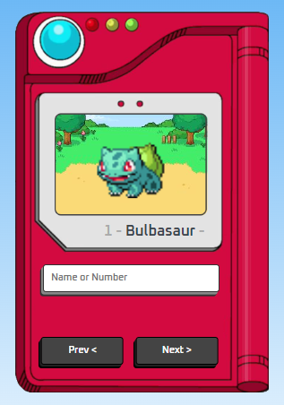

# Tutorial criação de Pokédex (HTML/CSS/JS)

## Veja o projecto - [aqui](https://gt-pokedex-project.netlify.app/)

## O projeto foi realizado seguindo um [tutorial no youtube](https://youtu.be/SjtdH3dWLa8)

### Nome do vídeo:
> Como criar uma Pokedex com HTML, CSS e JavaScript | Projeto Completo

Todos os créditos para o canal - **Manual do Dev**
